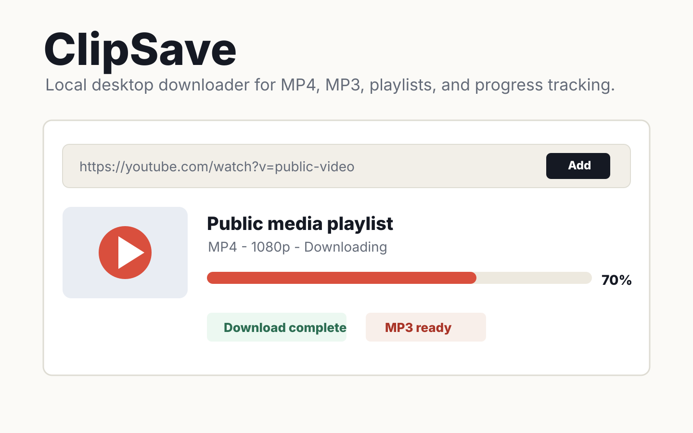

# ClipSave



ClipSave is a source-available desktop app for saving public media you are allowed to download. It runs locally on macOS and Windows, bundles `yt-dlp` and `ffmpeg`, and saves files to `Downloads/ClipSave Downloads`.

ClipSave는 다운로드 권한이 있는 공개 미디어를 로컬에서 저장하기 위한 데스크톱 앱입니다. macOS와 Windows에서 실행되며 MP4, MP3, 재생목록 다운로드를 지원합니다.

## Downloads

The public website should be deployed with Cloudflare Pages from `site/`.

Installer files are distributed through GitHub Releases because the release zip files are larger than Cloudflare Pages' single static asset limit.

- macOS Apple Silicon: `ClipSave-1.4.0-mac-arm64.zip`
- Windows x64: `ClipSave-1.4.0-win-x64.zip`

## Features

- Download a single public video or an entire playlist.
- Save as MP4 video or extract MP3 audio.
- Choose video quality: best available, 1080p, 720p, 480p, 360p, 240p, 144p.
- View a friendly queue dashboard with progress bars.
- Move completed items into the Download Complete list automatically.
- Clean up intermediate `.webm` and `.m4a` files so only the final `.mp3` or `.mp4` remains.
- No account, cloud sync, or remote processing.

## Development

```bash
npm install
npm start
```

## Build Desktop Releases

```bash
npm run dist
```

Outputs:

- `dist/mac-arm64/ClipSave.app`
- `dist/ClipSave-1.4.0-mac-arm64.zip`
- `dist/ClipSave-1.4.0-win-x64.zip`
- `dist/win-unpacked/ClipSave.exe`

## Build Website

The website is static and lives in `site/`.

Cloudflare Pages settings:

- Build command: leave blank
- Output directory: `site`

Local check:

```bash
npm run site:check
```

If the repository changes later, configure the GitHub repository used by the website download links:

```bash
npm run configure:repo -- mippm153/Clipsave_youtube_download
```

See [Deployment](docs/DEPLOYMENT.md) and [Release Checklist](docs/RELEASE_CHECKLIST.md).

## Notes

ClipSave is intended for public content you have permission to download. It does not bypass DRM, paid access, private content, or login-protected media.

## License

ClipSave uses a protected source license. Personal, non-commercial use is allowed. Reuse, redistribution, modification, or commercial use requires prior written permission from the creator.

ClipSave는 보호형 소스 공개 라이선스를 사용합니다. 개인적, 비상업적 사용은 허용되지만 제작자의 사전 서면 허가 없이 재사용, 재배포, 수정, 상업적 이용을 할 수 없습니다.
