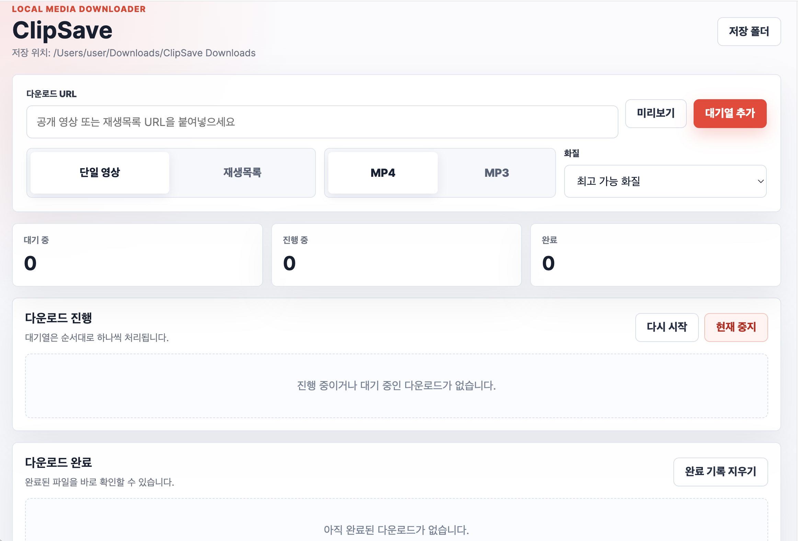

# ClipSave



ClipSave는 다운로드 권한이 있는 공개 영상과 재생목록을 로컬에서 저장하기 위한 데스크톱 앱입니다. macOS와 Windows에서 실행되며, MP4 영상 저장과 MP3 오디오 추출을 지원합니다.

<details>
<summary>English translation</summary>

ClipSave is a source-available desktop app for saving public videos and playlists you have permission to download. It runs on macOS and Windows, and supports MP4 video downloads and MP3 audio extraction.

</details>

## 다운로드

공식 웹사이트는 Cloudflare Pages로 배포되어 있습니다.

[https://clipsave.pages.dev](https://clipsave.pages.dev)

설치 파일은 GitHub Releases에서 제공합니다. 앱 zip 파일이 Cloudflare Pages의 단일 파일 제한보다 크기 때문에, 웹사이트는 다운로드 버튼을 GitHub Releases로 연결합니다.

- macOS Apple Silicon: `ClipSave-1.4.0-mac-arm64.zip`
- Windows x64: `ClipSave-1.4.0-win-x64.zip`

<details>
<summary>English translation</summary>

The public website is deployed with Cloudflare Pages.

[https://clipsave.pages.dev](https://clipsave.pages.dev)

Installer files are distributed through GitHub Releases because the release zip files are larger than Cloudflare Pages' single static asset limit.

- macOS Apple Silicon: `ClipSave-1.4.0-mac-arm64.zip`
- Windows x64: `ClipSave-1.4.0-win-x64.zip`

</details>

## 주요 기능

- 단일 공개 영상 또는 공개 재생목록 다운로드
- MP4 영상 저장 또는 MP3 오디오 추출
- 최고 가능 화질, 1080p, 720p, 480p, 360p, 240p, 144p 선택
- 대기열과 진행률 막대를 통한 직관적인 다운로드 관리
- 완료된 항목을 다운로드 완료 목록으로 자동 이동
- 중간 `.webm`, `.m4a` 파일 정리 후 최종 `.mp3` 또는 `.mp4`만 보관
- 계정, 클라우드 동기화, 원격 처리 없이 로컬에서 실행

<details>
<summary>English translation</summary>

- Download a single public video or an entire public playlist
- Save as MP4 video or extract MP3 audio
- Choose best available, 1080p, 720p, 480p, 360p, 240p, or 144p quality
- Manage downloads through a clear queue and progress bars
- Move completed items into the download complete list automatically
- Clean up intermediate `.webm` and `.m4a` files so only the final `.mp3` or `.mp4` remains
- Run locally with no account, cloud sync, or remote processing

</details>

## 개발 실행

```bash
npm install
npm start
```

## 배포 파일 빌드

```bash
npm run dist
```

생성 결과:

- `dist/mac-arm64/ClipSave.app`
- `dist/ClipSave-1.4.0-mac-arm64.zip`
- `dist/ClipSave-1.4.0-win-x64.zip`
- `dist/win-unpacked/ClipSave.exe`

## 웹사이트 배포

웹사이트는 `site/` 폴더에 있는 정적 사이트입니다.

Cloudflare Pages 설정:

- Build command: 비워두기
- Output directory: `site`

로컬 검사:

```bash
npm run site:check
```

저장소 주소가 바뀌면 다운로드 링크를 다시 설정합니다.

```bash
npm run configure:repo -- mippm153/Clipsave_youtube_download
```

자세한 내용은 [Deployment](docs/DEPLOYMENT.md)와 [Release Checklist](docs/RELEASE_CHECKLIST.md)를 확인하세요.

## 사용 안내

ClipSave는 저장 권한이 있는 공개 콘텐츠에만 사용해야 합니다. DRM, 유료 접근, 비공개 콘텐츠, 로그인 보호 콘텐츠 우회를 지원하지 않습니다.

## 라이선스

ClipSave는 보호형 소스 공개 라이선스를 사용합니다. 개인적, 비상업적 사용은 허용되지만 제작자의 사전 서면 허가 없이 재사용, 재배포, 수정, 상업적 이용을 할 수 없습니다.

허가 없는 상업적 이용은 관련 법률에 따라 법적 책임이 발생할 수 있습니다.

<details>
<summary>English translation</summary>

ClipSave uses a protected source license. Personal, non-commercial use is allowed. Reuse, redistribution, modification, or commercial use requires prior written permission from the creator.

Unauthorized commercial use may create legal liability where permitted by law.

</details>
